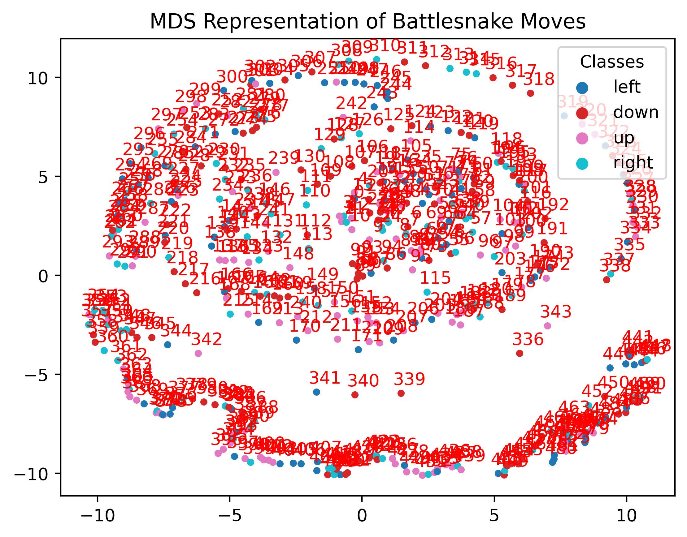

## Limitations:
- Only 1 opponent

## Attempt at clustering 1:
### Map each frame to a matrix representing the board:
```
// -1 represents a player body. -2 represents an enemy body. 1 represents food.
[ 0.  0.  1.  0.  0.  0.  0.  0.  0.  0.  0. 
  0.  0.  0.  0.  0.  0.  0.  0.  0.  0.  0.  
  0.  0.  1.  0.  0.  0.  0.  0.  0.  0.  0.  
  0.  0.  0.  0.  0.  0.  0.  0.  0.  0.  0.  
  1.  0. -2. -2.  0.  0.  0.  0.  0.  0.  0.  
  0.  0.  0. -2. -2. -2.  0.  0.  0.  0.  0.  
  0.  0.  0.  0.  0.  0. -1.  0.  0.  0.  0.  
  0.  0.  0.  0.  0. -1. -1.  0.  0.  0.  0.  
  0.  0.  0.  0.  0.  0.  0.  0.  0.  0.  0.  
  0.  0.  0.  0.  0.  0.  0.  0.  0.  0.  0.  
  0.  0.  0.  0.  0.  0.  0.  0.  0.  0.  0.]
```
### Resulting MDS:

