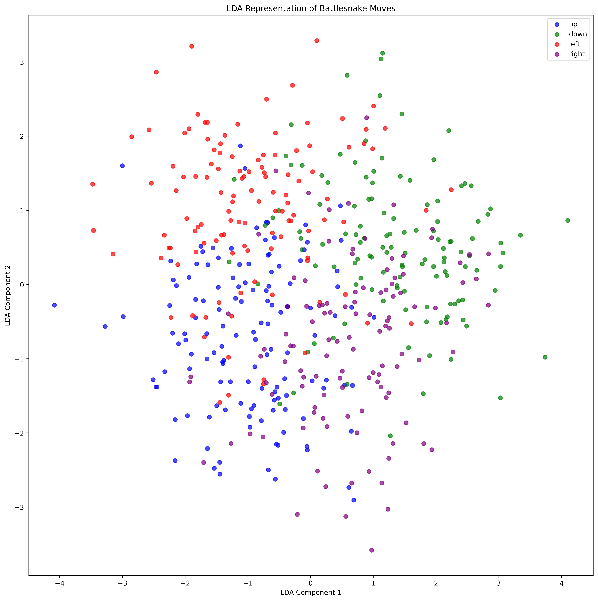
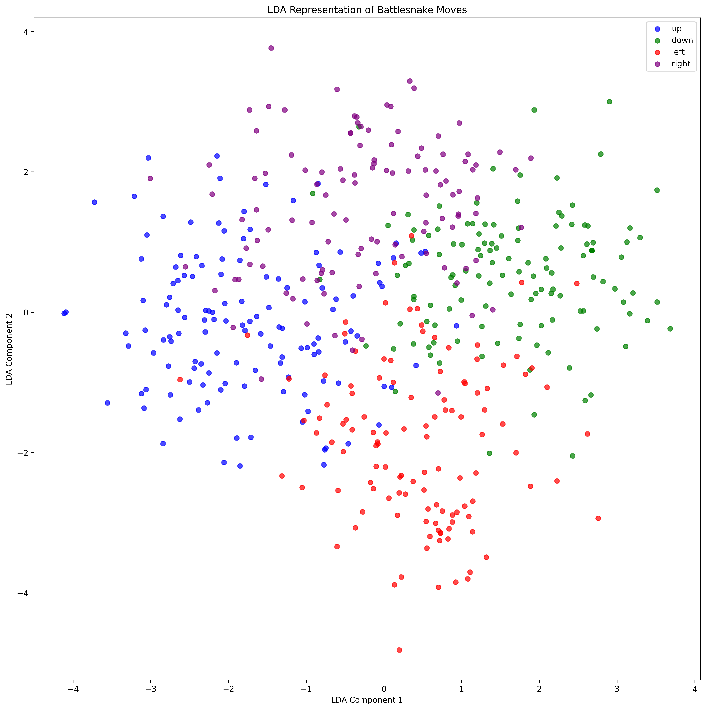

## Limitations:
- Only 1 opponent

## Attempt at preprocessing 1:
### Map each frame to a matrix representing the board:
```
// -1 represents a player body. -2 represents an enemy body. 1 represents food.
Data.__flatten_frame_to_board():
[ 0.  0.  1.  0.  0.  0.  0.  0.  0.  0.  0. 
  0.  0.  0.  0.  0.  0.  0.  0.  0.  0.  0.  
  0.  0.  1.  0.  0.  0.  0.  0.  0.  0.  0.  
  0.  0.  0.  0.  0.  0.  0.  0.  0.  0.  0.  
  1.  0. -2. -2.  0.  0.  0.  0.  0.  0.  0.  
  0.  0.  0. -2. -2. -2.  0.  0.  0.  0.  0.  
  0.  0.  0.  0.  0.  0. -1.  0.  0.  0.  0.  
  0.  0.  0.  0.  0. -1. -1.  0.  0.  0.  0.  
  0.  0.  0.  0.  0.  0.  0.  0.  0.  0.  0.  
  0.  0.  0.  0.  0.  0.  0.  0.  0.  0.  0.  
  0.  0.  0.  0.  0.  0.  0.  0.  0.  0.  0.]
```
### Resulting MDS:


## Attempt at preprocessing 2:
### Map each frame to a matrix representing the board, then append turn number:
```
// -1 represents a player body. -2 represents an enemy body. 1 represents food.
Data.__flatten_frame_i_to_board():
[ 0.  0.  1.  0.  0.  0.  0.  0.  0.  0.  0. 
  0.  0.  0.  0.  0.  0.  0.  0.  0.  0.  0.  
  0.  0.  1.  0.  0.  0.  0.  0.  0.  0.  0.  
  0.  0.  0.  0.  0.  0.  0.  0.  0.  0.  0.  
  1.  0. -2. -2.  0.  0.  0.  0.  0.  0.  0.  
  0.  0.  0. -2. -2. -2.  0.  0.  0.  0.  0.  
  0.  0.  0.  0.  0.  0. -1.  0.  0.  0.  0.  
  0.  0.  0.  0.  0. -1. -1.  0.  0.  0.  0.  
  0.  0.  0.  0.  0.  0.  0.  0.  0.  0.  0.  
  0.  0.  0.  0.  0.  0.  0.  0.  0.  0.  0.  
  0.  0.  0.  0.  0.  0.  0.  0.  0.  0.  0. 35.]
```
### Resulting MDS:


## Attempt at preprocessing 4:
### Pad player_body, enemy_body, food to a np array of length 100.
```
// first row represents food, then the player_body, then the enemy_body
Data.__flatten_frame_to_list():
[4002220000000000000000000000000000000000000000000000000000000000000000000000000000000000000000000000
 6676750000000000000000000000000000000000000000000000000000000000000000000000000000000000000000000000
 4243535455000000000000000000000000000000000000000000000000000000000000000000000000000000000000000000]
```
### Resulting MDS:


## Attempt at preprocessing 5:
### Pad player_body, enemy_body, food and current turn to a np array of length 100.
```
// first row represents food, then the player_body, then the enemy_body
Data.__flatten_frame_to_list():
[4002220000000000000000000000000000000000000000000000000000000000000000000000000000000000000000000000
 6676750000000000000000000000000000000000000000000000000000000000000000000000000000000000000000000000
 4243535455000000000000000000000000000000000000000000000000000000000000000000000000000000000000000000
 35000000000000000000000000000000000000000000000000000000000000000000000000000000000000000000000000000]
```
### Resulting MDS:


## Attempt at preprocessing 6:
### Map each frame to a matrix representing the board, feed into LDA
Appears to show _some_ class separation!
### Resulting MDS:


## Attempt at preprocessing 7:
### Pad player_body, enemy_body, food to a np array of length 100, append length of player, opponent and current turn feed into LDA
Appears to show even more class separation!
### Resulting MDS:


## Attempt at preprocessing 8:
### Pad player_body, enemy_body, food to a np array of length 100, append length of player, opponent and current turn, MinMax scale and feed into LDA
Slightly better results, but not too significant
### Resulting MDS:
